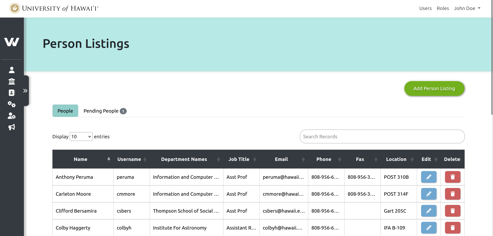

<h1 align="center">
    UH White Pages Management System
</h1>

    

## Project Overview

Our White Pages Management System, developed in collaboration with the ITS Department at the University of Hawai'i at Mānoa, is a modernized version of the faculty and staff recordkeeping system used for the UH System. Our goal in creating and sharing this system is that other universities can utilize this code for similar database management purposes.

## Getting Started
**Technologies Used:**

- Laravel
- Vue.js
- MySQL
- Bootstrap
- Git

**Installation**

**Environment for PHP and Laravel development** involves setting up the necessary software and tools to build and run web applications efficiently. Below are the steps to set up a basic environment for PHP and Laravel development:

1. **Install PHP**:
    - Download and install PHP from the official website: [PHP Downloads](https://www.php.net/downloads.php).
    - Make sure to add PHP to your system's PATH so you can run it from the command line.
    
2. **Install Composer**:
    - Composer is a package manager for PHP and is essential for Laravel.
    - Download and install Composer by following the instructions on the official website: [Composer](https://getcomposer.org/download/).

`composer create-project --prefer-dist laravel/laravel uh-white-page`, is the command to create a new Laravel project using Composer.

**Environment for Vue:** Ensure you have a local development environment equipped with Node.js and npm (Node Package Manager)

1. **Node.js and npm**:
    - Vue.js requires Node.js, which includes npm (Node Package Manager) for managing packages and dependencies. Download and install Node.js from the official website: [Node.js Downloads](https://nodejs.org/).
2. **install Vue.js using npm (Node Package Manager),** you can use the following command in your terminal or command prompt

**Setup:**

1. Clone the repository from [our GitHub repo](https://github.com/UHWPMS/white_pages).
2. Run `composer install` to install Laravel dependencies.
3. Create a `.env` file and configure your database settings.
4. Run `php artisan key:generate` to generate a new application key
5. Run `php artisan migrate` to set up the database tables.
6. Run database seeders
    1.  `php artisan db:seed --class=CreateAdminAndRolesSeeder` to seed the database with a sample admin user.
    2.  `php artisan db:seed --class=AnnouncementSeeder` to seed the database with a sample admin user.
7. Run `npm install` to install Vue.js and other frontend dependencies.
8. Run `npm run dev` to run the developer environment.
9. Start the development server with `php artisan serve`.

## Project Page

Provided below is an overview of our project

For more details about our project, please visit: <a href="https://glen-map-0a5.notion.site/d6bc4f6c4999458cb04efc4e6c548294?v=0737e27d22c04dc3bde0f53c481ea9b5">our Notion page</a>

## Notes for further development

This project, designed for the Information Technology Services (ITS) department, is currently in a developmental phase with certain sections remaining incomplete. We would like to suggest the following enhancements and additions to further advance this project:

**Person Listings & Department Listings pages**
- These pages currently uses Vue components to generate front-end pages dynamically depending on values given to the components. (see corresponding blade files) Performance for these pages can be improved by breaking down some dynamic Vue components to have some static views.

**Department Contacts page**
- There is a database table for this page that retrieves records associated for this page - this table can be deleted and Eloquent can be used to retrieve the records instead in its controller. 

**Admins page**
- Admins page needs assigning and unassigning logic similar to the Department Contacts page. 

**Utilizing View Model, Data Transfer Object (DTO) and Service classes**
- Currently, all business logic and view models are written in the controllers directly, but we recommend creating view models for each page, and implementing DTO and Service classes for better organization of the code.

**Database**
- We used Spatie's Laravel Permission package for implementing RBAC. Because of the addition of this package, we have some additional tables in the database. Tables created by this package at migration are all named in lowercases. Tables listed in our ER diagram (in our Notion project page) all start with a capital letter in non-Windows systems.
- In addition, we temporarily added a 'User' table for the purpose of recording passwords, but this part can also be replaced to incorporate UH Identity Access Management logic. 

